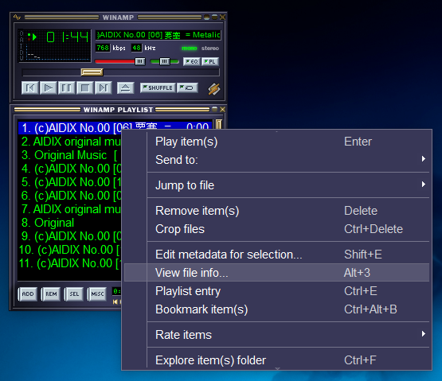
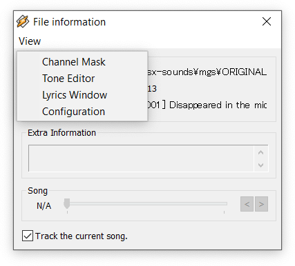
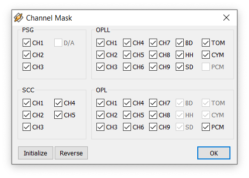
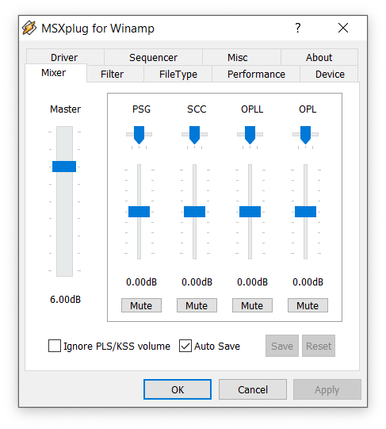
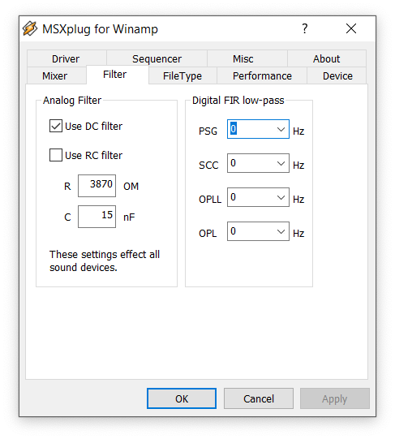

# in_msx.dll
in_msx.dll aka MSXplug is a MSX sound player plugin for Winamp 5.
It supports the following sound formats.

|EXT|Description|
|---|---|
|.kss|Sound data from varius systems|
|.mgs|MGSDRV data|
|.bgm|MuSICA or Kinrou5 data|
|.mbm|MoonBlaster data|
|.opx|OPLLDriver data|
|.mpk|MPK data|

Note: zip-compressed `.kss` files are not supported.

# How to install

1. Download in_msx.zip from the [release page](https://github.com/digital-sound-antiques/in_msx/releases).
2. Extract zip file and copy both in_msx.dll and in_msx.ini to Winamp 5's plugin directory.
3. Restart the Winamp.

## Note
If your Winamp is installed to a system folder like `C:\Program Files\` on Windows 8 or later, settings modified from MSXplug's UI  can not be persisted. To solve this problem, install Winamp to user's private folder instead of system folders. Or change security settings of in_msx.ini file:

- open security page on in_msx.ini properties sheet, select `Users` and then give `write` permission. 

  
  
# User Interface
## File Information Dialog
Right click on the playlist entry and select `View file info...` from the context menu.



Then, File Information dialog will appear.


from View menu, you can access channel mask, tone editor, lyrics and configuration dialog.



## Channel Mask Dialog
All channels can be muted separately. Changes are immediately applied on playing music.



## Configuration Dialog



You can also access this dialog by pressing F12 after in_msx plugin is activated - if no msx song is played, the plugin is still inactive thus F12 does no effect.

## Bonus - Retro Filter
If you prefer a retro low-pass like MSX turbo-R or FMPAC, try R=3870, C=15 and turn RC filter check-box on.



# How to build

Install [cmake][] 3.4 or later, [git for windows][] and [Visual Studio] 2015 or later.

[cmake]: https://cmake.org/
[git for windows]: https://git-for-windows.github.io/
[Visual Studio]: https://www.visualstudio.com/

Then, run the following commands from git-bash shell to generate `in_msx.vcxproj`.

```
$ git clone --recursive https://github.com/digital-sound-antiques/in_msx.git
$ cd in_msx
$ mkdir build
$ cd build
$ cmake ..
$ cmake --build . --config Release
```

You can also open `in_msx.vcxproj` with Visual Studio. To obtain `in_msx.dll`, just build `in_msx` project.
If you have some error to find MSVC compiler, try CMake 3.6 or later.
